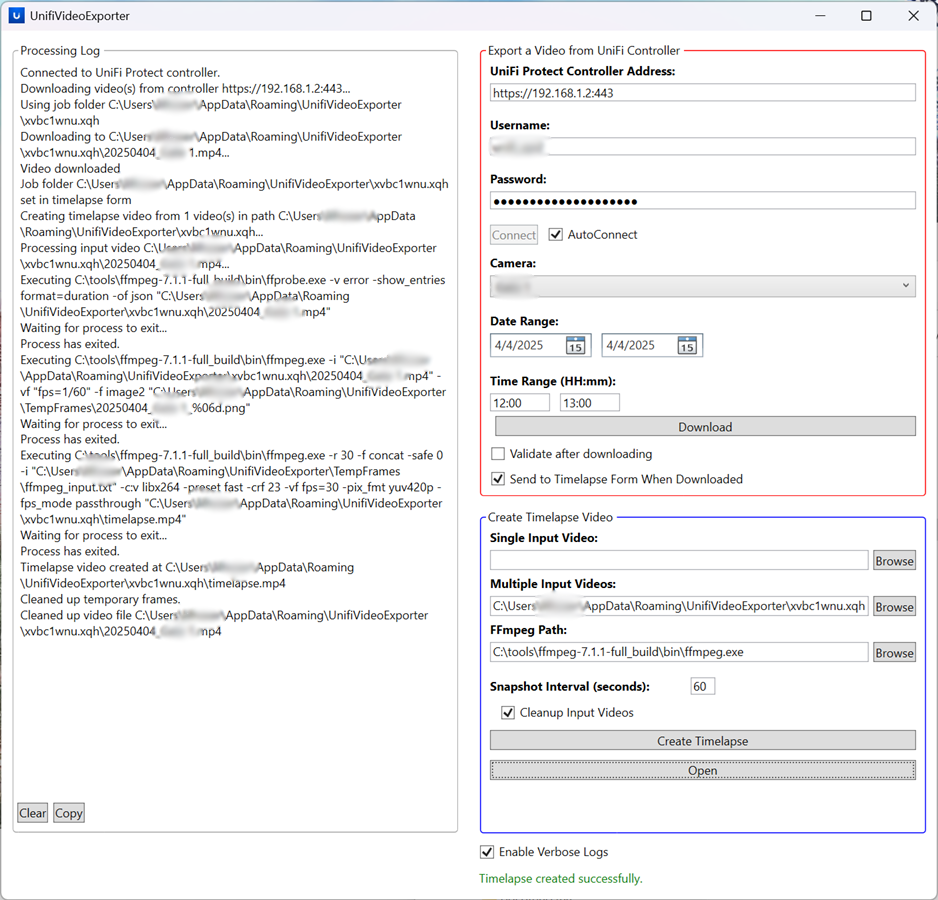

# UnifiVideoExporter
 `UnifiVideoExporter` is a simple .NET/WPF application for exporting videos from a UniFi controller (UNVR). The tool also allows you to create a timelapse video from any input video(s), on a schedule if you wish.

`UnifiVideoExporter` is mainly for archive automation - for example, by providing a date range, you can download a month's worth of video recordings from your UniFi controller and produce a single timelapse video, as a way to archive video content.

This tool uses the same web interface used by the official UniFi Protect web app. While the interface is not officially supported for use by end users (ie, it's undocumented), [the UiProtect community project](https://github.com/uilibs/uiprotect/blob/main/src/uiprotect/api.py) has reverse engineered the endpoints. Their project is used by the [UniFi Protect](https://www.home-assistant.io/integrations/unifiprotect) Home Assistant integration.

**Note**: As an experiment, this application was created with the assistance of AI. Read more below.

# Prerequisites
Currently, `UnifiVideoExporter` is a Windows-only .NET project for the following reasons:
* It uses a Windows-specific cryptography library
* It uses a Windows-specific task scheduler library

If you want to download videos from a UNVR controller, obviously you must have access to one of those, as well as the Protect app installed on it.  There is no special configuration required to interact with its API/web interface using `UnifiVideoExporter`.

If you just have some videos you want to merge into a timelapse video, you can still use this tool.

You will need to download `ffmpeg` somewhere locally. Windows users should download the full build from [gyan.dev](https://www.gyan.dev/ffmpeg/builds/). I recommend the latest full release build `ffmpeg-release-full.7z`.

# User Interface
1. Output logs are in the left pane (tick `Enable Verbose Logs` to get debugging information)
1. The top right pane allows you to download/export videos from a UniFi controller
1. The bottom right pane allows you to create a timelapse video from one or more input videos
1. Click the `Task Scheduler` button to create a Windows task to automatically download videos from the UniFi controller and create timelapse videos on a regular basis.

## Export a Video from UniFi Controller

Please read all sections below carefully before proceeding. It is important to understand that the Protect API used by `UnifiVideoExporter` is undocumented and can change at any time. Use of this tool represents a certain risk that you must accept, and I am not responsible for whatever happens. You have been warned!

### Authenticating

**_IMPORTANT_: Great care should be taken not to lock out your UniFi account. UniFi Protect (non-enterprise version) does not document the lock out conditions and does not provide a way to change that policy or unlock an account. If you mistype your password a few times, you can completely lock yourself out of your UNVR forever. I highly recommend creating a new _local only_ admin account and using it from `UnifiVideoExporter`.**

It is assumed that `UnifiVideoExporter` is being run from the same private network as your controller, so the controller address is likely something like `192.168.1.2:443`. Remote access/VPN scenarios are _probably_ supported, but add a layer of complexity that I've not tested myself. Proceed with caution.

Before proceeding, it is very important that you create a new local-only admin account in your UNVR controller:
1. Open your web browser and type in the address of your controller, eg `https://192.168.1.2:443`. Do NOT login through SSO (`https://unifi.ui.com/consoles`).
1. Login using an admin account - it can be a local-only admin account or an SSO account.
   * Note: if using SSO and 2FA is enabled, make sure your 2FA device is nearby to approve the login attempt.
1. Click the settings icon in the lower left
1. Click `Admins & Users`
1. Click `Create New Admin`
1. Tick `Restrict to local access only`
1. Tick `Use a Predefined Role` and select `Super Admin`
1. Enter a user name and password.
1. Click `Create` button

In the top right UI pane of `UnifiVideoExporter`, simply enter the address of your controller, your new local-only admin user name and password, and click connect. If you'd like `UnifiVideoExporter` to automatically reconnect to your controller each time it starts, tick the `AutoConnect` checkbox.

If you receive some sort of authentication error, like "invalid credentials", **STOP**. Do not keep hammering the Connect button. The account will be irrevocably locked and you'll just have to remove it and create a different one. At this point, you will need to do some investigating that doesn't involve resubmitting the credentials (maybe go check the logs on the controller). As a last resort, try to login directly to the controller through the web interface. If the credentials are accepted, there is likely a change in the undocumented UniFi Protect API and you should stop using `UnifiVideoExporter` immediately. If you want to be helpful, file a ticket on github with details of your scenario.

### Downloading

**_IMPORTANT_**: Please read the section on authentication above. Do not use your primary UniFi credentials with this tool. I am not responsible for what happens if you ignore this advice.

Once you've authenticated to the controller, a list of available cameras should show in the `Camera` drop-down list. Select a camera and a date/time range, then click `Download`. If you're paranoid, tick the `Validate after downloading` checkbox to have `ffmpeg` verify the downloaded video before wasting time on chopping it into PNG frames during timelapse creation. I recommend doing this at least once when you first use the tool or connect to a new controller, just to make sure everything looks right. Then, going forward, leave it unchecked, as it is a time-consuming operation.

The next step, if you want to, is to create a timelapse video.

## Creating timelapse videos

Generally, the purpose of a timelapse video is to reduce the size and runtime of an input video(s). You need to accept an interval of "precision" that's good enough for your use case, in seconds, and put this in the "Snapshot interval" field. For example, if I want to create a timelapse of a garden growing over a month period during the spring, a precision on the order of minutes (let's say, 10 minutes) might be sufficient. This means that the input videos will be split into 10-minute frames and then glued back together into the final timelapse video. For most use cases, I've found that a smaller snapshot interval provides better details - say 15 seconds. For very small or short videos (e.g, a few minutes), an appropriate interval might be 5 seconds. You can also adjust frames per second (FPS) in the output video for a smoother video.

The timelapse form can be "fed" from the "export a video from unifi controller" form by checking the "Send to timelapse form when downloaded" checkbox before downloading videos. This will pre-populate the "multiple input videos" form field with the location of the download videos.

## Task scheduler

_Note_: Windows restricts task scheduler access to administrator accounts only, so you must run `UnifiVideoExporter` as administrator to use this feature.

# Q&A/Tips

* **How long does it take?** For downloading videos, it depends on the UNVR hardware (as well as settings) and your internet connection. For timelapse video creation, it depends on your system hardware. My UNVR is from 2021 and I'm using a modern and powerful PC to generate the timelapse videos; here is my experience for a single 2.6GB video:
   * Time for UNVR to generate the video:  16 seconds
   * Time to download over fiber: 70 seconds
   * 60-second timelapse creation: 65 seconds
* **How does snapshot interval impact timelapse video size?** Anecdotally, a 56-minute/2.6gb input video reduces to a 3-second/41MB timelapse video when using a 30-second snapshot interval. Decreasing to 15-second interval makes a much more useful timelapse video of length 7 seconds.
* Your entries in the `UnifiVideoExporter` form are saved locally for convenience. Your user name and password credentials are stored using the standard [Windows DPAPI cryptography library](https://learn.microsoft.com/en-us/dotnet/api/system.security.cryptography.protecteddata?view=windowsdesktop-9.0).
* These are the `ffmpeg`/`ffprobe` commands used, if you want to run them manually:
   * frame extraction: `-i \"{VideoFile}\" -vf \"fps=1/{SnapshotInterval}\" -f image2 \"{OutputFileNameFormat}\"`
   * frame reassembly: `-r 30.0 -f concat -safe 0 -i \"{InputFileList}\" -c:v libx264 -preset fast -crf 23 -vf fps=30 -pix_fmt yuv420p -fps_mode vfr \"{OutputFilePath}\"`
   * video validation: `-v error -i \"{VideoFilePath}\" -f null -`
   * video duration (`ffprobe`): `-v error -show_entries format=duration -of json \"{VideoFilePath}\"`
* Here are the UniFi endpoints I use (taken from Grok's inspection of [the UiProtect community project](https://github.com/uilibs/uiprotect/blob/main/src/uiprotect/api.py)):
   * Auth endpoint: `/api/auth/login`
   * Cameras endpoint: `/proxy/protect/api/cameras`
   * Export endpoint: `/proxy/protect/api/video/export`
* If the camera has breaks in its recording (e.g, the camera went offline multiple times in a day), UniFi API appears to sometimes successfully stitch together valid video feed from the specified time ranges, but at other times, I have seen it miss footage. In some cases, it will cancel the web request entirely for that time segment. In these cases, `UnifiVideoExporter` will carry on and go to the next time segment, reporting a message in the log window.
* To prevent the Protect API from cancelling a download, `UnifiVideoExporter` breaks up a request for a large timespan (e.g., 8 hours) into multiple 1-hr requests.
* You can interleave a download operation and a timelapse operation - the former takes more resources on the UNVR, while the latter takes resources only from your local machine. Bear in mind you might receive spurious cancellations if you try to do too much at once.
* Use the Task Scheduler in `UnifiVideoExporter` to schedule a Windows Task to periodically create timelapse videos from your UniFi cameras.

# Use of AI to build `UnifiVideoExporter`

This is a "vibe coding" project, as much as I loathe the term. I used Grok AI to assist with creating this application. I would say that the bulk of the code (> 80%) was produced by Grok, but I did substantial refactoring, reorganizing, some polishing, and used some different approaches in various cases (for example, `AsyncCommand`s and validation). And of course, as the adult in the room, I had to make sure it was actually doing what I wanted, which took substantial time.

I would say that the overall experience was positive - it definitely allowed me to focus more on _what_ I was trying to do rather than _how_ - with a multitude of caveats outlined below. In general, AI can get you a rough 80% solution, but it's on you to actually make it work.

It's worth noting that Grok is not the top performer in the space of coding tasks, nor is it optimal to use the web app interface through X, like I was doing. According to the [HuggingFace BigCodeBench leaderboard](https://huggingface.co/spaces/bigcode/bigcodebench-leaderboard), Grok 3-beta is currently 12th at the `hard set` coding tasks. Of course, it depends on what metrics you are considering and what leaderboard you're looking at, so this isn't a true measure on its own.

You can access the full conversation [here](https://x.com/i/grok/share/00DsPok2rgxAuCavX0Ph1nQvo).

## Things Grok did well
* **Creating simple XAML UI elements** - I found that Grok was really good at adding UI elements as I progressed through my design, probably because XAML is so structured and limited. In fact, the XAML code Grok initially produced for the main application was pretty much perfect.
* **Implementing MVVM pattern** - I didn't have to explain the purpose of a view model or how to bind data to the UI; Grok intuited all of this, including validation (which it was not polished at - see later section).
* **Intricacies of C# and WPF** - Grok seemed to be an expert with oddities and complexities of the languages involved; as an example, using a c# converter to change the text on a XAML control based on a bound viewmodel value (one of my pet peeves of WPF). Grok had a mastery of C# parallel task library and async concepts, including proper ordering of stdout pipe redirection and continuation tasks. I found it helpful to bounce programming and design choices off Grok at various points - should I use an extension method here?
* **Troubleshooting and breadth of general knowledge** - This is probably the area Grok excelled at the most - whether it be a UI quirk, fighting the UniFi controller, or an error from `ffmpeg`, Grok was a sharp assistant for tracking down possible explanations and fixes. Only once or twice was Grok not able to arrive at the solution.
* **General coding assistant** - When I couldn't remember how to do something in C# like encrypting credential information, Grok would instantly spit out the code (and remind me about C# `SecureString`!).

## Things Grok did poorly or not very well

* **Can be dense and repetitive** - sometimes Grok would avoid or only partially address my question. A rephrasing or suggesting solution would get him going again. When Grok is confused or can't suggest a solution, it typically repeats itself - which is better than the old way of just hallucinating and spewing garbage.
* **Usually the code doesn't compile or has obvious logic flaws** - One glaring case I recall is Grok kept misspelling `ffmpeg` as `fffmpeg`, causing issues in UI code. Grok would often insert code that didn't work - for example, trying to set the value of a private field on a UI control or passing a deprecated switch to `ffmpeg`. With a nudge, Grok would quickly recognize and recover from the problem, but this illustrates the point that you can't rely on the model to be 100% correct.
* **Writing concise, well-structured code using common design patterns** - While the XAML code was near perfect, the c# code had questionable/variable formatting and style choices. Unless I instructed Grok to do so, the code was not structured using common design patterns (such as MVVM) and did not employ best coding practices by leveraging interfaces, inheritence, factories, and so on. Grok did not originally segment the code logically (e.g, all `ffmpeg` related routines in its own class file).
* **Writing concise responses** - all LLMs I've worked with default to being extremely verbose. When coding, this can be disastrous and it's a wasteful use of tokens (which is becoming less a concern as models become more efficient). Grok would only be concise if instructed with each prompt. Usually "show only the code that changed" worked.
* **WPF validation** - Grok seemed to struggle with this one, to the point where I just rewrote it all myself. While the c# binding validation was correct, Grok's use of WPF templates for `Validation.ErrorTemplate` and related scaffolding code was all wrong. Which is ironic, because I had worked with Grok on this before on a different project, and after much needling, managed to produce an elegant solution.
* **Solution dump** - Sometimes Grok would provide four solutions to a problem and then glom them all together in the corresponding code update, without considering whether the combination of solutions was necessary, evaluating which was the best one, or considering whether using all of them would cause other problems (which it often did). An example of this behavior is when I was getting DTS errors in the concat demuxer (negative timestamp calculations for input frames) - it suggested adding multiple switches to `ffmpeg` that had various implications on the overall performance and output.
